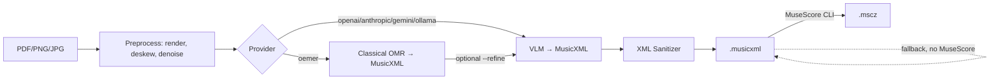

# pdf2mscz

Convert sheet-music scans (**PDF / PNG / JPG**) into editable **MuseScore (`.mscz`)** and **MusicXML** using a modular multi-provider pipeline: classical open-source OMR (`oemer`) + vision LLMs (OpenAI, Anthropic, Gemini, Ollama).

## Architecture



## Install

```bash
pip install .
cp .env.example .env  # add API keys
```

See [docs/setup.md](docs/setup.md) for MuseScore/Ollama details.

## Usage

```bash
# VLM transcription → .mscz (needs MuseScore CLI installed)
pdf2mscz convert scan.pdf score.mscz --provider openai --model gpt-4o

# Pages 1-3 only, with preprocessing
pdf2mscz convert scan.pdf score.mscz --provider anthropic --pages 1-3 --preprocess

# Classical local OMR, no API key
pdf2mscz convert scan.pdf score.musicxml --provider oemer --format musicxml

# Hybrid: oemer transcribed, GPT-4o refined
pdf2mscz convert scan.pdf score.mscz --provider oemer --refine openai

# Local VLM
pdf2mscz convert scan.pdf score.musicxml --provider ollama --model llava:13b --format musicxml

# Helpers
pdf2mscz providers
pdf2mscz check-deps
```

## Python API

```python
from pdf2mscz import ConversionOptions, convert

out = convert("scan.pdf", "score.mscz", ConversionOptions(provider="openai"))
print(out.musicxml_path, out.mscz_path)
```

## Adding a provider

Subclass `AbstractProvider` (`pdf2mscz/converters/base.py:24`), decorate with
`@register_provider`, implement `image_to_musicxml(images) -> ConversionResult`.
See `openai_provider.py` as reference.

## License

AGPL-3.0-or-later (see `LICENSE`).
