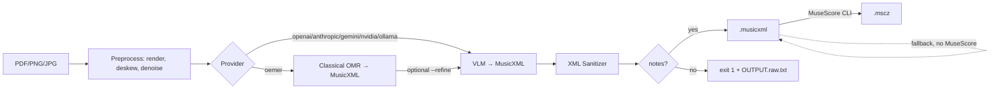

# pdf2mscz

[](https://pypi.org/project/pdf2mscz/)
[](https://github.com/marianwolf/pdf2mscz/actions/workflows/ci.yml)

Convert sheet-music scans (**PDF / PNG / JPG**) into editable **MuseScore (`.mscz`)** and **MusicXML** using a modular multi-provider pipeline: classical open-source OMR (`oemer`) + vision LLMs (OpenAI, Anthropic, Gemini, NVIDIA, Ollama).

## Architecture



## Install

```bash
# PyPI — core plus the provider extra(s) you use:
pip install "pdf2mscz[openai]"     # GPT-4o / OpenAI
pip install "pdf2mscz[anthropic]"  # Claude
pip install "pdf2mscz[gemini]"     # Google Gemini
pip install "pdf2mscz[nvidia]"     # NVIDIA NIM hosted VLMs
pip install "pdf2mscz[ollama]"     # local Ollama (no key needed)
pip install "pdf2mscz[oemer]"      # classical local OMR
pip install "pdf2mscz[all]"        # everything

# from source (development):
# python3 -m venv .venv && source .venv/bin/activate
pip install -e ".[dev,all]"

cp .env.example .env  # add API keys
```

See [docs/setup.md](docs/setup.md) for MuseScore/Ollama details.

## Usage

```bash
# VLM transcription → .mscz (needs MuseScore CLI installed)
pdf2mscz convert scan.pdf score.mscz --provider openai --model gpt-4o

# Pages 1-3 only, with preprocessing
pdf2mscz convert scan.pdf score.mscz --provider anthropic --pages 1-3 --preprocess

# Classical local OMR, no API key
pdf2mscz convert scan.pdf score.musicxml --provider oemer --format musicxml

# Hybrid: oemer transcribed, GPT-4o refined
pdf2mscz convert scan.pdf score.mscz --provider oemer --refine openai

# Local VLM
pdf2mscz convert scan.pdf score.musicxml --provider ollama --model llava:13b --format musicxml

# NVIDIA NIM hosted VLM (free credits at build.nvidia.com)
pdf2mscz convert scan.pdf score.mscz --provider nvidia
pdf2mscz convert scan.pdf score.mscz --provider nvidia --model meta/llama-3.2-11b-vision-instruct

# Helpers
pdf2mscz providers
pdf2mscz check-deps
```

> **Vision models only.** Every provider call sends the rendered page image, so
> text-only LLMs cannot be used — `--model` must point at a vision/multimodal
> model. This includes the "lightning" class of NVIDIA NIM models (e.g.
> `nvidia/nemotron-3.5-lightning-30b-a3b`): the endpoint accepts the model name
> but rejects the image parts with
> `400 … Received multimodal data but multimodal processing is not enabled`,
> and the conversion fails. Use a vision-capable model instead, e.g.
> `meta/llama-3.2-11b-vision-instruct`, `meta/llama-3.2-90b-vision-instruct`
> or `nvidia/nemotron-3-nano-omni-30b-a3b-reasoning`.

## Output validation

A run only succeeds if the result actually contains music:

- The model answer is sanitized **and** checked (measure + pitched-note counts)
  *before* anything is written. Empty, prose-only or broken output exits with
  status 1 and keeps the raw model answer in `OUTPUT.raw.txt` for inspection
  (`--no-save-raw` to skip).
- On a terminal it then asks whether to retry with the local `oemer` engine;
  pass `--with-oemer` to accept non-interactively (CI/pipes never prompt).
- Commentary that leaked into the markup, prose-carried duplicate measures and
  impossible elements (`<clef>8</clef>`, pitch without octave) are stripped;
  invalid answers are sent back for repair up to `--retry` times (default 1).
- VLM requests are split **per staff system** (`--chunk system`, the default),
  so each answer is small enough to fit the model's output budget;
  `--chunk page` restores one request per page. Detected staff lines also give
  a barline estimate — getting far fewer measures back triggers a warning.
- Those staff-line requests run **in parallel**: up to `--jobs 4` at a time
  (the first line still runs alone, so the remaining prompts carry its
  established `<attributes>`). Use `--jobs 1` for strictly serial requests or
  raise it (e.g. `--jobs 8`) when the API's rate limit has headroom. Merged
  output is identical regardless of `--jobs`; `--preprocess` pages are
  processed in parallel too.
- `--max-tokens` (default 8192, `0` = server default) caps each answer, and
  hitting that cap is reported instead of silently truncating the score.
- `--allow-empty` opts back into writing a placeholder score (with a warning).

```bash
# Transcribe per staff line, repair twice, keep the raw answers
pdf2mscz convert scan.pdf score.mscz --provider nvidia --retry 2

# Eight parallel staff-line requests (when the rate limit allows it)
pdf2mscz convert scan.pdf score.mscz --provider openai --jobs 8

# One request per page, higher output cap
pdf2mscz convert scan.pdf score.mscz --provider openai --chunk page --max-tokens 16000

# Fall back to local classical OMR without being asked
pdf2mscz convert scan.pdf score.mscz --provider nvidia --with-oemer
```

## Python API

```python
from pdf2mscz import ConversionOptions, TranscriptionError, convert

try:
    out = convert("scan.pdf", "score.mscz", ConversionOptions(provider="openai"))
except TranscriptionError as exc:
    print(exc.reason, exc.raw_path)   # e.g. "prose_only", PosixPath('score.raw.txt')
else:
    print(out.musicxml_path, out.mscz_path, out.stats.summary(), out.warnings)
```

## License

AGPL-3.0-or-later (see [License](LICENSE)).
