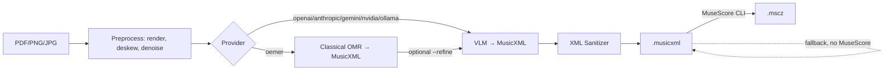

# pdf2mscz

[](https://pypi.org/project/pdf2mscz/)
[](https://github.com/marianux/pdf2mscz/actions/workflows/ci.yml)

Convert sheet-music scans (**PDF / PNG / JPG**) into editable **MuseScore (`.mscz`)** and **MusicXML** using a modular multi-provider pipeline: classical open-source OMR (`oemer`) + vision LLMs (OpenAI, Anthropic, Gemini, NVIDIA, Ollama).

## Architecture



## Install

```bash
# PyPI — core plus the provider extra(s) you use:
pip install "pdf2mscz[openai]"     # GPT-4o / OpenAI
pip install "pdf2mscz[anthropic]"  # Claude
pip install "pdf2mscz[gemini]"     # Google Gemini
pip install "pdf2mscz[nvidia]"     # NVIDIA NIM hosted VLMs
pip install "pdf2mscz[ollama]"     # local Ollama (no key needed)
pip install "pdf2mscz[oemer]"      # classical local OMR
pip install "pdf2mscz[all]"        # everything

# from source (development):
# python3 -m venv .venv && source .venv/bin/activate
pip install -e ".[dev,all]"

cp .env.example .env  # add API keys
```

See [docs/setup.md](docs/setup.md) for MuseScore/Ollama details.

## Usage

```bash
# VLM transcription → .mscz (needs MuseScore CLI installed)
pdf2mscz convert scan.pdf score.mscz --provider openai --model gpt-4o

# Pages 1-3 only, with preprocessing
pdf2mscz convert scan.pdf score.mscz --provider anthropic --pages 1-3 --preprocess

# Classical local OMR, no API key
pdf2mscz convert scan.pdf score.musicxml --provider oemer --format musicxml

# Hybrid: oemer transcribed, GPT-4o refined
pdf2mscz convert scan.pdf score.mscz --provider oemer --refine openai

# Local VLM
pdf2mscz convert scan.pdf score.musicxml --provider ollama --model llava:13b --format musicxml

# NVIDIA NIM hosted VLM (free credits at build.nvidia.com)
pdf2mscz convert scan.pdf score.mscz --provider nvidia
pdf2mscz convert scan.pdf score.mscz --provider nvidia --model meta/llama-3.2-11b-vision-instruct

# Helpers
pdf2mscz providers
pdf2mscz check-deps
```

## Python API

```python
from pdf2mscz import ConversionOptions, convert

out = convert("scan.pdf", "score.mscz", ConversionOptions(provider="openai"))
print(out.musicxml_path, out.mscz_path)
```

## License

AGPL-3.0-or-later (see [License](LICENSE)).
